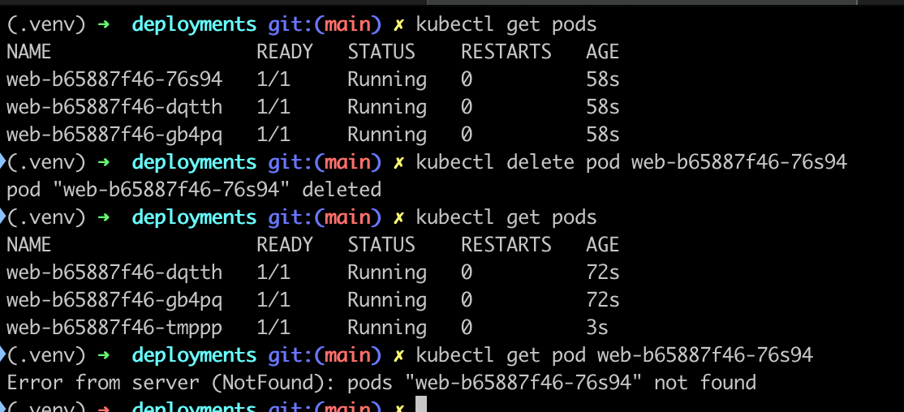

# Deployments:

In Kubernetes Deployments are a Resource that allows a user to create one or more pods as part of an application, it allows the user to specify the desired state that the world should be in (ex: How many pods should run)

## Example:

```
apiVersion: apps/v1
kind: Deployment
metadata:
  name: web
spec:
  replicas: 3                      # how many Pods
  selector:
    matchLabels:
      app: web
  template:                         # Pod template
    metadata:
      labels:
        app: web
    spec:
      containers:
        - name: web
          image: nginx:1.25
          ports:
            - containerPort: 80
```

You can create this deployment using the following command:

```
kubectl create -f deployment.yaml
```

In the example above you can see that kubernetes creates 3 pods each with one nginx container

These pods are self healing, you can see from the following screenshot that kubernetes automatically spins up a new pod after I delete one

